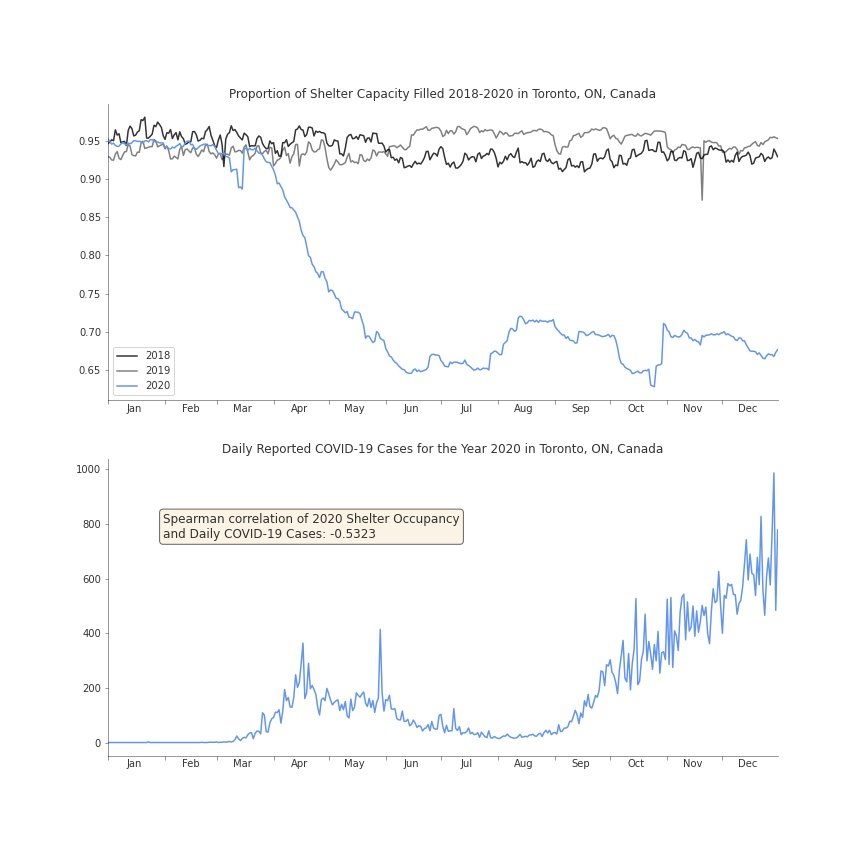

# Plotting the Relationship between COVID-19 Cases and Shelter Occupancy in Toronto, ON, Canada

Since the beginning of the pandemic, [tent encampments have been increasingly popping up](https://www.thestar.com/news/gta/2020/05/14/tents-housing-the-homeless-are-popping-up-around-toronto-heres-what-the-city-is-doing-about-it.html) in the city. In the latter half of the year, a group [went before a Toronto court](https://www.cbc.ca/news/canada/toronto/toronto-homeless-tents-shelters-pandemic-1.5746955) to argue that they are safer in such encampents than in shelters provided by the city due to the COVID-19 pandemic. They were seeking to stop eviction orders being issued by the city to residents of encampments located in its public parks.

I wanted to visualize the relationship between shelter occupancy and daily reported cases in Toronto.

The first chart shows the daily proportion of total shelter capacity in the city that was filled for the years 2018 through 2020. I used the proportion of capacity filled as opposed to the raw occupancy numbers to account for shelters reducing their capacity in 2020 to comply with the province's COVID-19 restrictions. As you can see, shelter occupancy was relatively stable in 2018 and 2019 with shelters consistently being about 95% full. In April 2020 occupancy begins to plunge.

The second chart plots the number of daily reported COVID-19 cases in Toronto. I computed the Spearman correlation between the two variables for 2020, which shows a moderate negative correlation.
